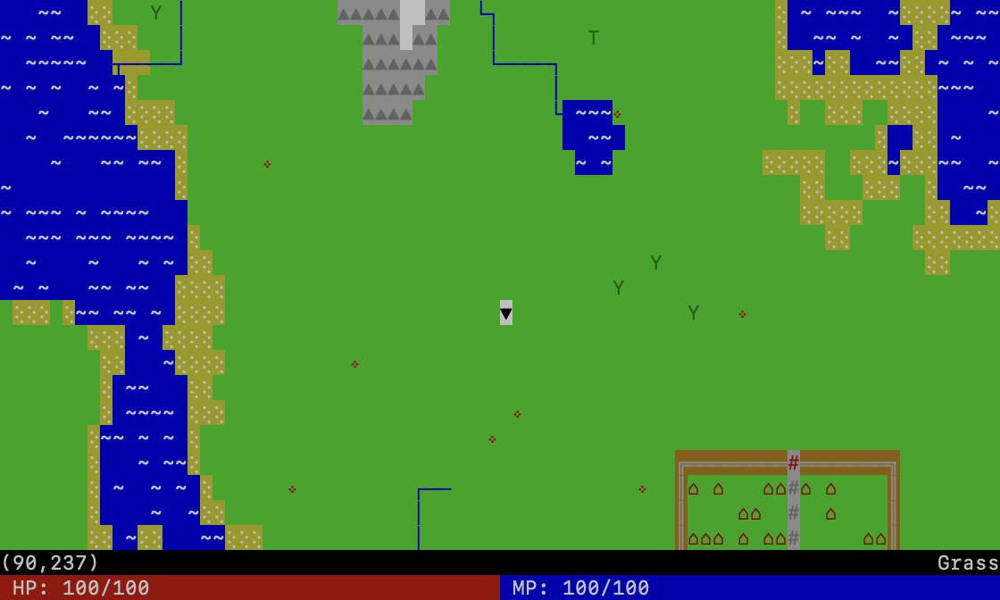

isles
=====

A small terminal based "game" using curses, written as an experiment with procedural generation.



## Install & Run

To install the necessary dependencies with [poetry](https://python-poetry.org), run:
```
poetry install
```

And then run the game using:
```
poetry run python game.py
```
